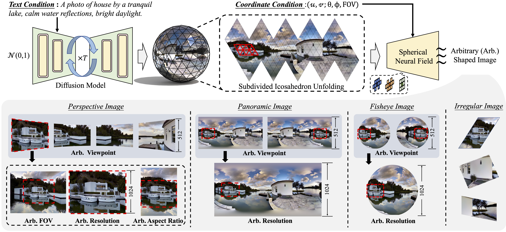
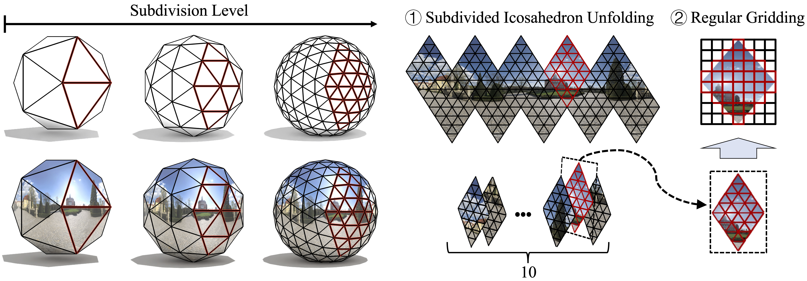

# ASIG: Arbitrary-Shaped Image Generation via Spherical Neural Field Diffusion



<p align="justify">
  <strong>ASIG</strong> is the official codebase for <strong>Arbitrary-Shaped Image Generation via Spherical Neural Field Diffusion</strong>.
  It is designed to support high-quality image synthesis across diverse image shapes, including <strong>perspective</strong>,
  <strong>panoramic</strong>, and <strong>fisheye</strong> views, while enabling explicit control over spatial attributes
  such as <strong>viewpoint</strong>, <strong>field-of-view (FOV)</strong>, and <strong>resolution</strong>.
</p>

<p align="justify">
  The framework is built on two key ideas from the paper:
</p>

<ul align="justify">
  <li><strong>Mesh-based spherical latent diffusion</strong>, which generates a complete scene representation on the sphere and uses seam-aware denoising to maintain semantic and spatial consistency across viewpoints.</li>
  <li><strong>Spherical neural field sampling</strong>, which extracts arbitrary regions from the scene representation with coordinate conditions, enabling flexible and distortion-aware image generation at different shapes and resolutions.</li>
</ul>

## 🌟 Features


<ul align="justify">
  <li><strong>Panoramic, Perspective, and Fisheye Generation</strong>: ASIG supports high-quality image generation across three image forms within a unified framework: panoramic images, perspective images, and fisheye images.</li>
  <li><strong>Controllable Spatial Attributes</strong>: ASIG enables explicit control over image resolution, camera viewpoint, and field-of-view (FOV) during generation.</li>
  <li><strong>Arbitrary-Shaped Image Generation</strong>: In ASIG, "arbitrary-shaped" means not only supporting different projection types, but also flexibly generating images with different spatial attributes under a single generative framework.</li>
</ul>

## 🔨 Installation

<p align="justify">
  We recommend the following environment:
</p>

- Linux
- Python `3.9`
- CUDA `11.8` (or another version compatible with your local PyTorch build)
- PyTorch `2.0.1`
- torchvision `0.15.2`

<p align="justify">
  Create a fresh conda environment:
</p>

```bash
conda create -n ASIG python=3.9 -y
conda activate ASIG
```

<p align="justify">
  Install PyTorch first. For CUDA 11.8, a typical command is:
</p>

```bash
pip install torch==2.0.1 torchvision==0.15.2 --index-url https://download.pytorch.org/whl/cu118
```

<p align="justify">
  Install the repository requirements:
</p>

```bash
pip install -r requirements.txt
```

## 🚀 Train

<p align="justify">
  Run all commands from the repository root.
</p>

### Training Data

<p align="justify">
  The training dataset can be downloaded from <a href="https://pan.baidu.com/s/10-q5hfiGoQWiCP7B2WV6Xg?pwd=1234">resources</a> with extraction code <code>1234</code>.
</p>

<p align="justify">
  After downloading, place the dataset files under <code>dataset/</code>, or set:
</p>

```bash
export ASIG_DATASET_ROOT=/path/to/dataset
```

### Arg-map Generation

<p align="justify">
  If the downloaded dataset package does not include the required arg-map <code>.mat</code> files, you can generate them with:
</p>

```bash
bash make_arg_map.sh dataset
bash make_arg_map.sh panorama
```

<p align="justify">
  This step generates the geometric index / mapping files used by ASIG. In practice, the generated arg-map determines the target image resolution,
  camera viewpoint, field-of-view (FOV), and image type used for sampling, such as panoramic, perspective, or fisheye-style outputs.
</p>

#### Arg-map Indexing with L-subdivision



<p align="justify">
  This figure shows how the sphere is discretized before arg-map generation. ASIG first builds a subdivided icosahedron on the sphere, then uses the vertices / faces on this structure as geometric indices for later sampling and rendering.
</p>

<p align="justify">
  In practice, the subdivision makes the spherical representation denser and more uniform, so each image location can be matched to a stable spherical index.
  This is why the arg-map can serve as a lookup table between image-space coordinates and the underlying spherical scene representation.
</p>

### S1 Training

<p align="justify">
  <code>S1</code> uses the config file <code>cfgs/s1.yaml</code>.
</p>

```bash
bash s1.sh
```

Equivalent command:

```bash
CUDA_VISIBLE_DEVICES=0,1,2,3,4,5,6,7 torchrun --standalone --nproc-per-node=8 run.py \
  --cfg cfgs/s1.yaml \
  --save-root save/s1
```

### S2 Training

<p align="justify">
  <code>S2</code> uses the config file <code>cfgs/s2.yaml</code> and loads the stage-2 related checkpoints under <code>checkpoints/</code>.
</p>

```bash
bash s2.sh
```

Equivalent command:

```bash
CUDA_VISIBLE_DEVICES=0,1,2,3,4,5,6,7 torchrun --standalone --nproc-per-node=8 run.py \
  --cfg cfgs/s2.yaml \
  --save-root save/s2
```

## 📒 Inference

<p align="justify">
  The inference resources can be downloaded from <a href="https://pan.baidu.com/s/10-q5hfiGoQWiCP7B2WV6Xg?pwd=1234">resources</a> with extraction code <code>1234</code>.
  The corresponding checkpoints will be uploaded later.
</p>

### Test

<p align="justify">
  Run with:
</p>

```bash
bash test_cfg.sh
```

<p align="justify">
  If you want to override the default paths:
</p>

```bash
MODEL_PATH=checkpoints/inference/model.pth \
CFG_SCALE=6 \
bash test_cfg.sh
```
